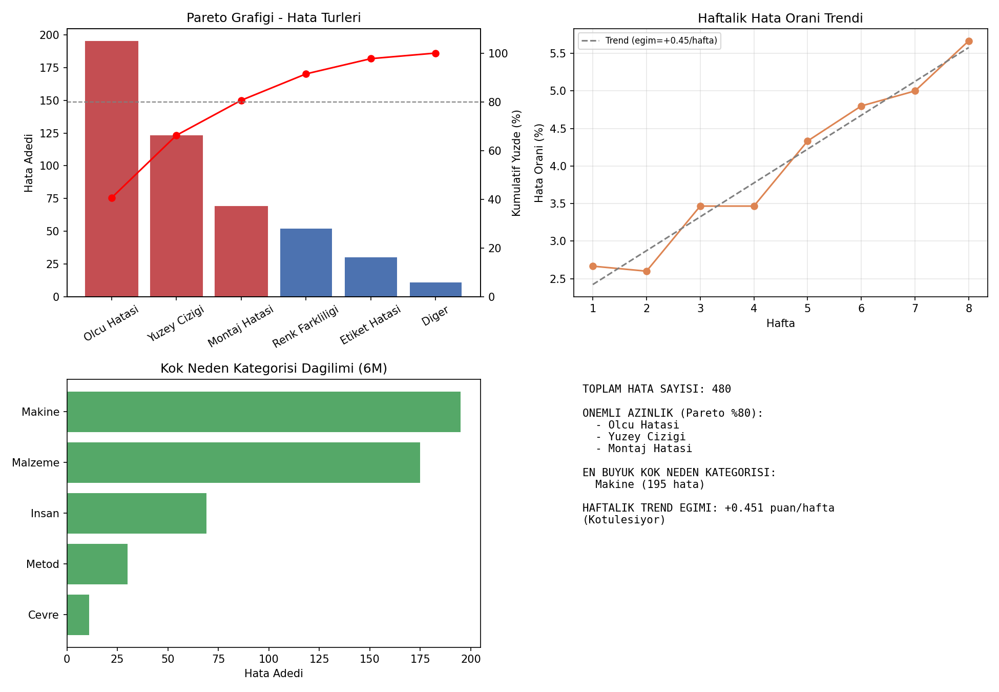

# Six Sigma DMAIC — Kök Neden Analizi (Pareto + Trend + 6M Kategorileme)


Bir üretim hattındaki hata kayıtlarını analiz ederek en kritik hata
türlerini (Pareto ilkesi), zaman içindeki hata oranı eğilimini ve
hataların hangi ana köke (6M) bağlı olduğunu ortaya çıkaran bir
Six Sigma DMAIC (Define-Measure-Analyze-Improve-Control) destek aracı.



## Problem Tanımı

Bir montaj hattında son 8 haftada tespit edilen hatalı parçaların
kayıtları tutuluyor. Kalite ekibi, sınırlı kaynaklarla en yüksek etkiyi
yaratacak iyileştirmeye odaklanmak istiyor. Bunun için hangi hata
türlerinin toplam hataların büyük kısmını oluşturduğunu, hata oranının
zaman içinde artıp artmadığını ve bu hataların hangi ana nedene (İnsan,
Makine, Metod, Malzeme, Ölçüm, Çevre) bağlı olduğunu bilmesi gerekiyor.

## Yöntem

1. **Pareto Analizi**: Hata türleri sıklığa göre sıralanır, kümülatif
   yüzdesi hesaplanır ve toplam hataların %80'ini oluşturan "önemli
   azınlık" belirlenir (klasik 80/20 kuralı).
2. **Trend Analizi**: Haftalık hata oranı hesaplanır ve doğrusal
   regresyonla eğim (artıyor mu / azalıyor mu) belirlenir.
3. **6M Kök Neden Kategorileme**: Her hata türü, Ishikawa (balık kılçığı)
   diyagramının klasik 6M kategorilerinden birine (İnsan, Makine, Metod,
   Malzeme, Ölçüm, Çevre) eşlenerek en sorunlu kategori tespit edilir.

## Kullanılan Kütüphaneler

- `numpy` — veri üretimi ve doğrusal trend hesaplama
- `pandas` — gruplama (groupby), sıklık tabloları
- `matplotlib` — Pareto grafiği, trend grafiği, kategori grafiği

## Çalıştırma

```bash
pip install -r requirements.txt
python dmaic_analiz.py
```

## Çıktılar

- `dmaic_analiz.png` — 4 panelli özet görsel (Pareto, trend, 6M kategori, metin özeti)
- `pareto_tablosu.csv` — hata türü bazlı kümülatif tablo
- `haftalik_trend.csv` — haftalık hata oranları
- `ham_hata_verisi.csv` — ham (satır bazlı) hata kayıtları
- Konsola yazdırılan özet rapor

## Örnek Sonuç

480 hatalık örnek veri setinde, **3 hata türü (Ölçü Hatası, Yüzey Çiziği,
Montaj Hatası) toplam hataların %80'ini oluşturuyor** — yani iyileştirme
çabalarının önceliği bu üç alana verilmeli. En büyük kök neden kategorisi
**Makine** (195 hata). Haftalık trend eğimi pozitif (+0.45 puan/hafta),
yani hata oranı zamanla kötüleşiyor ve acil müdahale gerektiriyor.

## Olası Geliştirmeler

- Gerçek bir MES/ERP hata kaydı kaynağından (CSV/veritabanı) okuma
- Hata başına maliyet bilgisi ekleyip Pareto'yu maliyete göre de sıralama
- İstatistiksel anlamlılık testi (ki-kare) ile trend eğiminin anlamlılığının doğrulanması
